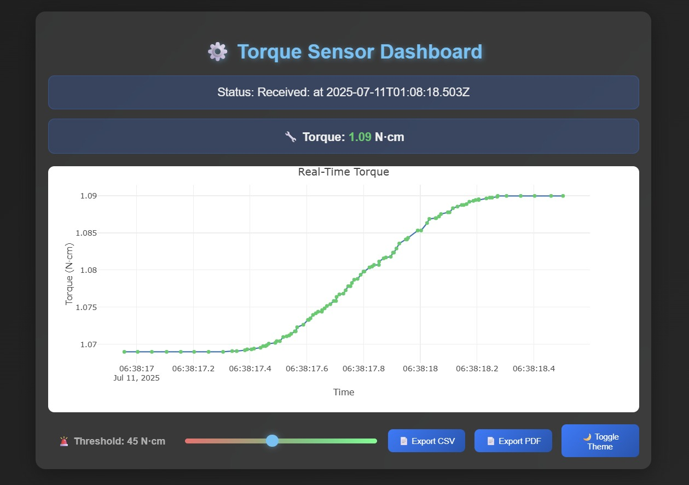

# Torque Readings User Interface

This project provides a user interface for displaying real-time torque readings, offering users an intuitive and interactive way to monitor and analyze torque data.

 

## Features

- **Real-Time Data Display**: Continuously updates torque readings as new data arrives.
- **User-Friendly Visualization**: Displays torque values in a clear, easy-to-read format, possibly with gauges, graphs, or numerical values.
- **Responsive Layout**: The interface adapts to different screen sizes, making it accessible on desktop and mobile devices.
- **Customizable Settings**: Options to adjust data refresh rates, units, or visualization styles (if implemented).
- **Error Handling**: Notifies users in case of data transmission errors or sensor issues.
- **Historical Data View**: Allows users to view previous torque readings or trends over time (if implemented).

## Getting Started

1. Clone the repository.
2. Install any required dependencies listed in `requirements.txt` (if applicable).
3. Run the application as described in the documentation or main script.

## Example Use Case

This UI is intended for applications such as:
- Industrial machine monitoring
- Automotive testing rigs
- Robotics torque feedback

---

*For more information, refer to the source code and documentation provided in this repository.*
